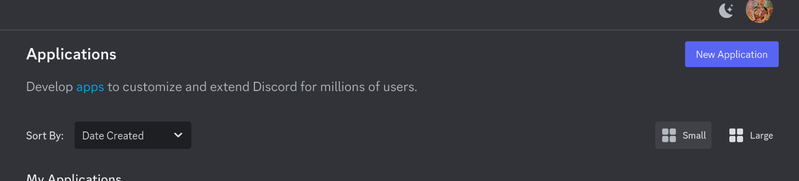
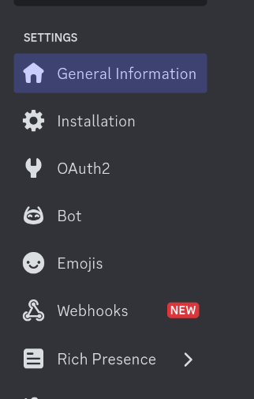
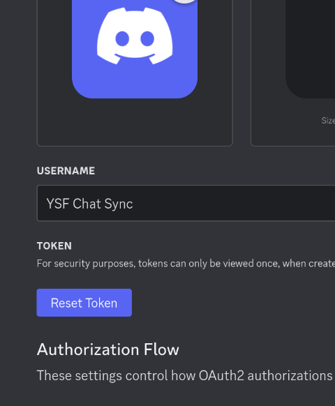
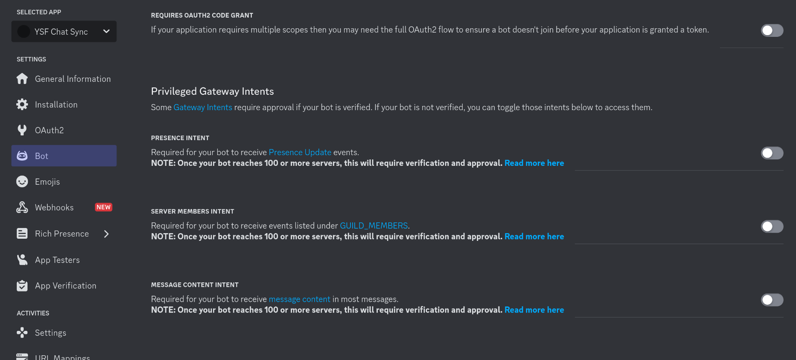
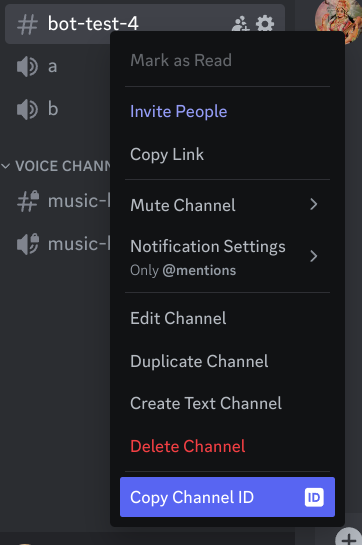

# Creating a Discord Bot account

1. Go to [Discord Developer Portal](https://discord.com/developers/applications),
 and login with your Discord account.
2. Click on `New Application` and give your bot a name.
 
3. Go to the left sidebar and click on `Bot`.
 
4. Click on `Reset Token` and copy the token. This your bot token for `DISCORD_TOKEN` in `config.py`.
 
5. Scroll down to `Privileged Gateway Intents`.
6. Enable **Message Content** Intent. This is important!
  

# Getting Channel ID

1. Go to your Discord server and right click on the channel where you want to sync the chat.
2. Click on `Copy ID` to copy the channel ID.
  
3. Paste the channel ID in `CHANNEL_ID` in `config.py`.
